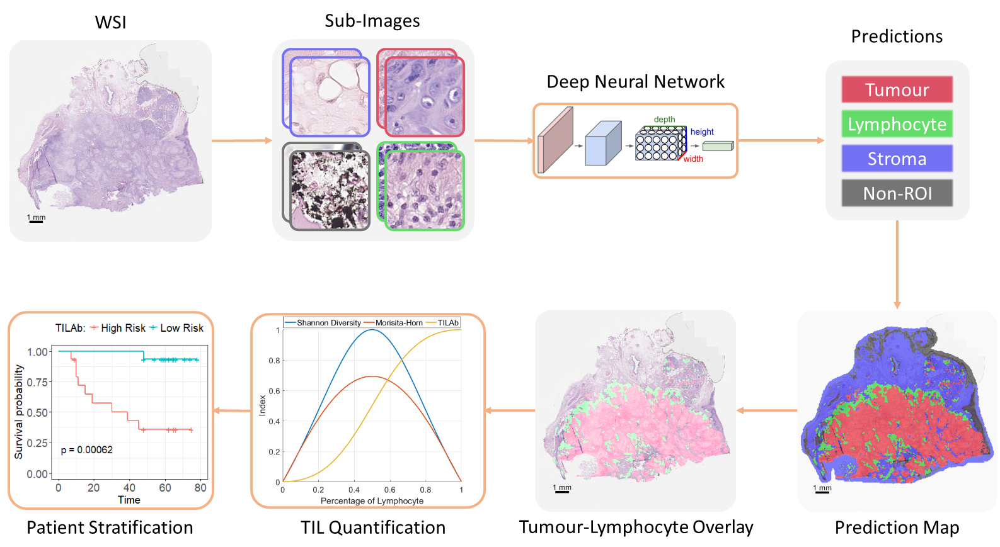

# [A Novel Digital Score for Abundance of Tumour Infiltrating Lymphocytes Predicts Disease Free Survival in Oral Squamous Cell Carcinoma](https://tia-lab.github.io/TILAb-Score/)

### Table of Contents
0. [Introduction](#introduction)
0. [Citation](#citation)
0. [Dataset](#Dataset)
0. [Model](#model)
0. [Prerequisites](#prerequisites)
0. [License](#License)

### Introduction

This repository contains the implementation of TILAb-score as described in the paper.

### Citation

The journal paper on this work is currently under review in **Nature Scientific Reports**. If you use this code in your research, please cite our abstract on this work:

	@misc{shaban2018prognostic,
        title={Prognostic significance of automated score of tumor infiltrating lymphocytes in oral cancer.},
        author={Shaban, Muhammad and Khurram, Syed Ali and Hassan, Mariam and Mushtaq, Sajid and Loya, Asif and Rajpoot, Nasir},
        year={2018},
        publisher={American Society of Clinical Oncology}
    }

### Dataset
The datset for training should be organized in following hierarchy:
```
dataset
   -- train
       -- 0_Stroma
       -- 1_Non_ROI
       -- 2_Tumour
       -- 3_Lymphocyte
   -- valid
       -- 0_Stroma
       -- 1_Non_ROI
       -- 2_Tumour
       -- 3_Lymphocyte
```
We have plan to release the train and validation dataset after acceptance of our paper in Nature Scientific Reports journal. Please contact Prof. Nasir Rajpoot (n.m.rajpoot@warwick.ac.uk) for dataset related queries.

### Training
The training.py file in `src/` directory will train the model using the dataset in `dataset/` directory. You may need to tune the hyperparameters for training on your own dataset to train an optimal model.

### Model
The trained model used to produce the results in the paper is available in the `models/` directory.

### Prerequisites
Following software packages will be required to run this code:

```
-- Python 3.5
   -- tensorflow-gpu=1.8.0
   -- keras=2.1.6
   -- openslide
   -- opencv_python
   -- scipy
-- R packages
   -- survival
   -- survMisc
   -- gdata
   -- ggplot2
   -- survminer
   -- rms
```
## Authors

See the list of [contributors](https://github.com/TIA-Lab/TILAb_Score/graphs/contributors) who participated in this project.

## License

This project is licensed under the GNU General Public License - see the [LICENSE.md](https://github.com/TIA-Lab/TILAb_Score/blob/master/License.md) file for details.
